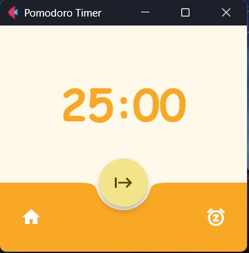
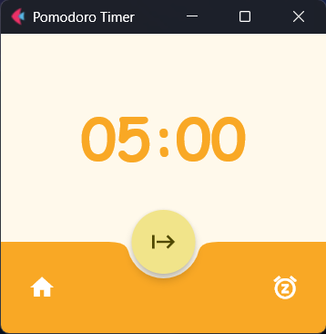

# Pomodoro Timer
[](https://flet.dev)
[](https://python.org)
[](LICENSE)
This Pomodoro was built as a personal learning exercise to improve my Python skills and gain experience with **Flet**

<div style="display: flex; justify-content: center; gap: 20px; flex-wrap: wrap;">
  
  
</div>

## Upcoming Features
- Customizable Focus/Break durations
- Short vs Long break options
- Improved UI/Visual design
- Always on Top mode
- Sound effects

## Run from Source
1. Clone the repository:
```bash
git clone https://github.com/lieserl-git/PomodoroTimer.git
cd PomodoroTimer
```
2. Install Dependencies:
```bash
pip install flet pyinstaller
```
3. Build command: This command creates a standalone executable in the dist folder
```bash
pyinstaller --onefile --windowed --name "PomodoroTimer" src/main.py
```

